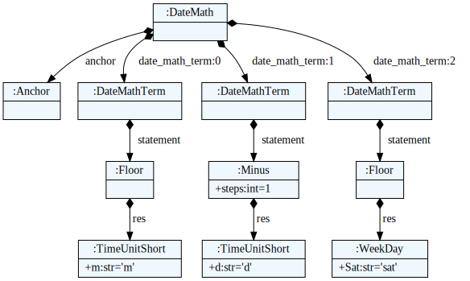

# Cronspell Python Package / CLI Tool
***Chronometry Spelled Out***

[](https://codecov.io/gh/iilei/cronspell)

Date-expression domain specific language parsing. A neat way to express things like "First Saturday of any year", or "3rd thursdays each month" and such.


## Features

### Python

Cronspell is heavily inspired by Grafana's relative Date picker user interface. It shines when configuration is needed to reflect irregular date-distances such as in the example below.

`cronspell` lets you express relative dates such as "last saturday of last month" and converts it to a date object for use in your python project.

### Cli

The same interface, exposed to the command line. Formatted via `isodate` by default -- which is
open for coniguration using the `--format` option.


## Example

To get the last saturday of last month:

```
"now /m -1d /sat"
```

The same, more verbose:
```
"now /month -1day /sat"
```

which instructs the parser to perform the following sequence of operations:




## Credits

* Domain-Specific-Language Parser: [TextX]
* This package was created with [The Hatchlor] project template.

[TextX]: https://textx.github.io/textX/
[The Hatchlor]: https://github.com/florianwilhelm/the-hatchlor
